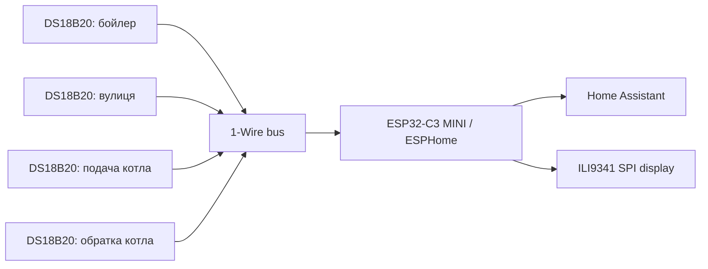

# Boiler Temperature

Моніторинг температури системи опалення та ГВП на базі ESP32-C3 MINI, ESPHome і Home Assistant.

Проєкт збирає температури з 4 датчиків DS18B20, передає їх у Home Assistant і показує основні значення на локальному SPI-дисплеї ILI9341. Основний фокус проєкту - стабільна робота 24/7 у реальних умовах біля котла, бойлера та зовнішнього датчика.

## Пріоритети

1. Стабільність роботи DS18B20.
2. Коректність даних без помилкових `85°C` та `-127°C`.
3. Керована Git-інфраструктура і версіонування ESPHome YAML.
4. Відображення даних на ILI9341 без зайвого навантаження на ESP32-C3.

## Що вимірюється

| Датчик | Призначення | Орієнтовна довжина лінії |
| --- | --- | --- |
| Бойлер | Температура ГВП | ~3-4 м |
| Вулиця | Зовнішня температура | ~3-4 м |
| Подача котла | Температура подачі | <1 м |
| Обратка котла | Температура обратки | <1 м |

Усі датчики DS18B20 живляться від `3.3V`, не в паразитному режимі.

## Апаратна частина

- ESP32-C3 MINI.
- 4 x DS18B20.
- Резистор підтяжки `4.7 кОм` між `DATA` та `3.3V`.
- LCD SPI-дисплей ILI9341.
- Home Assistant як центральна система моніторингу.
- ESPHome для прошивки, логування та інтеграції.

## Фактична конфігурація ESPHome

Основний конфіг: `esphome/boiler-temperature.yaml`.

Поточні параметри з робочого YAML:

| Компонент | Значення |
| --- | --- |
| Плата | `esp32-c3-devkitm-1` |
| Framework | `esp-idf` |
| Logger | `VERBOSE` |
| 1-Wire | `GPIO4` |
| Підсвітка дисплея | `GPIO10`, LEDC, `1000 Hz` |
| SPI CLK | `GPIO6` |
| SPI MOSI | `GPIO7` |
| ILI9341 CS | `GPIO3` |
| ILI9341 DC | `GPIO5` |
| ILI9341 RESET | `GPIO2` |
| Обертання дисплея | `270` |
| Оновлення дисплея | `5s` |

Адреси DS18B20 винесені в `substitutions` головного YAML:

| Датчик | ID в ESPHome | Адреса |
| --- | --- | --- |
| Подача котла | `kotel_podacha` | `0x6601203815d2af28` |
| Обратка котла | `kotel_obratka` | `0x993c01d075c31328` |
| Бойлер | `boiler_temperatura` | `0xdf3c01d075c89728` |
| Вулиця | `pogoda_temperatura` | `0x113c01d607e36a28` |

Паролі Wi-Fi, API encryption key, OTA password і пароль fallback AP зберігаються в `esphome/secrets.yaml` та підключаються через `!secret`. Цей файл доданий у `.gitignore` і не повинен потрапляти в Git.

## Архітектура

Поточна архітектура передбачає одну 1-Wire шину для всіх DS18B20. ESPHome читає значення температур, публікує їх у Home Assistant через native API і паралельно виводить основні показники на SPI-дисплей.



## Поточний стан

Стабільно працюють датчики:

- бойлер;
- вулиця.

Проблема виникає при підключенні датчиків котла:

- інші датчики можуть переставати відповідати;
- 1-Wire шина стає нестабільною;
- можливі помилки читання `85°C` або `-127°C`.

Ймовірна причина: деградація сигналу 1-Wire через топологію, довжину відгалужень, навантаження шини або перешкоди біля котельного обладнання.

## Основна проблема

Нестабільна робота однієї 1-Wire шини при одночасному підключенні всіх 4 датчиків.

Перший технічний пріоритет - стабілізувати 1-Wire до роботи всіх датчиків 24/7. Дисплей і візуальне оформлення мають бути вторинними, доки показники температур не читаються стабільно.

## Рекомендована стратегія стабілізації

1. Перевірити роботу кожного датчика окремо.
2. Додати датчики на шину по одному і зберігати логи кожного етапу в `logs/`.
3. Скоротити довгі відгалуження, уникати зіркоподібної топології.
4. Перевірити підтяжку `4.7 кОм`; за потреби протестувати `3.3 кОм` або окремі шини.
5. Відділити лінії котла від довгих ліній бойлера/вулиці, якщо одна шина не стабілізується.
6. Збільшити `update_interval`, щоб не перевантажувати 1-Wire.
7. Оновлювати дисплей рідше, ніж читаються датчики, або тільки при зміні значень.

## Приклад ESPHome: одна 1-Wire шина

```yaml
substitutions:
  kotel_podacha_adr: "0x6601203815d2af28"
  kotel_obratka_adr: "0x993c01d075c31328"
  boiler_adr: "0xdf3c01d075c89728"
  pogoda_adr: "0x113c01d607e36a28"

one_wire:
  - platform: gpio
    pin: GPIO4
    id: one_wire_bus

sensor:
  - platform: dallas_temp
    id: kotel_podacha
    address: ${kotel_podacha_adr}
    one_wire_id: one_wire_bus
    name: "Котел подача t°C"
    update_interval: 10s

  - platform: dallas_temp
    id: kotel_obratka
    address: ${kotel_obratka_adr}
    one_wire_id: one_wire_bus
    name: "Котел обратка t°C"
    update_interval: 10s

  - platform: dallas_temp
    id: boiler_temperatura
    address: ${boiler_adr}
    one_wire_id: one_wire_bus
    name: "Бойлер t°C"
    update_interval: 10s

  - platform: dallas_temp
    id: pogoda_temperatura
    address: ${pogoda_adr}
    one_wire_id: one_wire_bus
    name: "Погода °C"
    update_interval: 10s
```

Це відповідає поточному файлу `esphome/boiler-temperature/packages/sensors.yaml`.

## Приклад ESPHome: розділення на дві 1-Wire шини

Якщо одна шина нестабільна, практичний варіант для ESP32-C3 - рознести короткі та довгі лінії на різні GPIO.

```yaml
one_wire:
  - platform: gpio
    pin: GPIO4
    id: ow_boiler_room

  - platform: gpio
    pin: GPIO5
    id: ow_long_lines

sensor:
  - platform: dallas_temp
    one_wire_id: ow_boiler_room
    address: ${kotel_podacha_adr}
    name: "Котел подача t°C"
    id: kotel_podacha
    update_interval: 15s

  - platform: dallas_temp
    one_wire_id: ow_boiler_room
    address: ${kotel_obratka_adr}
    name: "Котел обратка t°C"
    id: kotel_obratka
    update_interval: 15s

  - platform: dallas_temp
    one_wire_id: ow_long_lines
    address: ${boiler_adr}
    name: "Бойлер t°C"
    id: boiler_temperatura
    update_interval: 15s

  - platform: dallas_temp
    one_wire_id: ow_long_lines
    address: ${pogoda_adr}
    name: "Погода °C"
    id: pogoda_temperatura
    update_interval: 15s
```

## Діагностика

Для 24/7 системи важливо бачити не лише температуру, а й стан самого вузла.

```yaml
binary_sensor:
  - platform: status
    name: "Boiler Temperature Status"

sensor:
  - platform: template
    name: "Heap Free"
    unit_of_measurement: "B"
    update_interval: 30s
    lambda: |-
      return heap_caps_get_free_size(MALLOC_CAP_8BIT);

  - platform: template
    name: "Heap Max"
    unit_of_measurement: "B"
    update_interval: 30s
    lambda: |-
      return heap_caps_get_largest_free_block(MALLOC_CAP_8BIT);

  - platform: wifi_signal
    name: "WiFi RSSI"
    id: wifi_rssi
    entity_category: diagnostic
    update_interval: 30s

  - platform: copy
    source_id: wifi_rssi
    name: "WiFi %"
    filters:
      - lambda: |-
          return std::min(std::max(2 * (x + 100.0f), 0.0f), 100.0f);
    unit_of_measurement: "%"
    entity_category: diagnostic

  - platform: uptime
    name: "Uptime"
    unit_of_measurement: "год"
    accuracy_decimals: 1
    filters:
      - multiply: 0.0002778

text_sensor:
  - platform: uptime
    name: "Uptime HR"
    update_interval: 60s

  - platform: version
    name: "Boiler Temperature ESPHome Version"
```

Логи проблемних запусків варто зберігати локально в `logs/`, наприклад `logs/esphome_logs.txt` або окремими файлами з датою. Вміст `logs/` ігнорується Git, окрім `logs/README.md`.

## Дисплей ILI9341

Дисплей має показувати дані, але не повинен впливати на стабільність 1-Wire.

Практичні правила:

- не оновлювати дисплей надто часто;
- уникати важких перерахунків у `lambda`;
- не малювати зайві елементи при кожному циклі;
- спочатку стабілізувати датчики без дисплея, потім увімкнути дисплей і порівняти логи.

У поточному YAML дисплей оновлюється раз на `5s`, підсвітка вмикається після старту на `40%`, а при недоступному значенні температури на екрані показується `--.-°C`.

## Структура проєкту

```text
boiler-temperature/
├── esphome/
│   ├── boiler-temperature.yaml
│   ├── secrets.yaml
│   └── boiler-temperature/
│       ├── packages/
│       │   ├── sensors.yaml
│       │   ├── display.yaml
│       │   ├── wifi.yaml
│       │   └── diagnostics.yaml
│       └── common/
│           ├── fonts.yaml
│           └── globals.yaml
├── hardware/
│   ├── wiring.md
│   ├── schematics.png
│   └── pinout.md
├── docs/
│   ├── architecture.md
│   ├── troubleshooting.md
│   ├── 1wire-debug.md
│   └── display.md
├── logs/
│   └── README.md
├── scripts/
│   └── flash.sh
├── .gitignore
├── README.md
└── CHANGELOG.md
```

## Git-процес

Рекомендований підхід:

- `main` - стабільна конфігурація, яка працює 24/7;
- `feature/one-wire-split` - експерименти з розділенням шин;
- `feature/display-ili9341` - робота над дисплеєм;
- `feature/diagnostics` - додаткові сенсори стану та логи.

Кожна зміна ESPHome YAML має фіксуватися в Git і коротко описуватися в `CHANGELOG.md`.

## Запуск

1. Заповнити `esphome/secrets.yaml`.
2. Перевірити GPIO у `esphome/boiler-temperature/packages/sensors.yaml` та `esphome/boiler-temperature/packages/display.yaml`.
3. Підключити один DS18B20 і перевірити лог.
4. Перевірити, що адреси датчиків у `substitutions` відповідають фактичним DS18B20.
5. Поступово підключити решту датчиків.
6. Прошити ESP32-C3:

```sh
cd scripts
./flash.sh
```

## Найближчі задачі

- Описати фактичний пін-аут у `hardware/pinout.md`.
- Оновити схему підключення в `hardware/schematics.png`.
- Провести тест однієї шини з 4 датчиками.
- Провести тест двох окремих 1-Wire шин, якщо одна шина нестабільна.
- Підібрати оптимальний `update_interval`.
- Додати діагностику помилок читання.
- Підключити ILI9341 після стабілізації датчиків.
